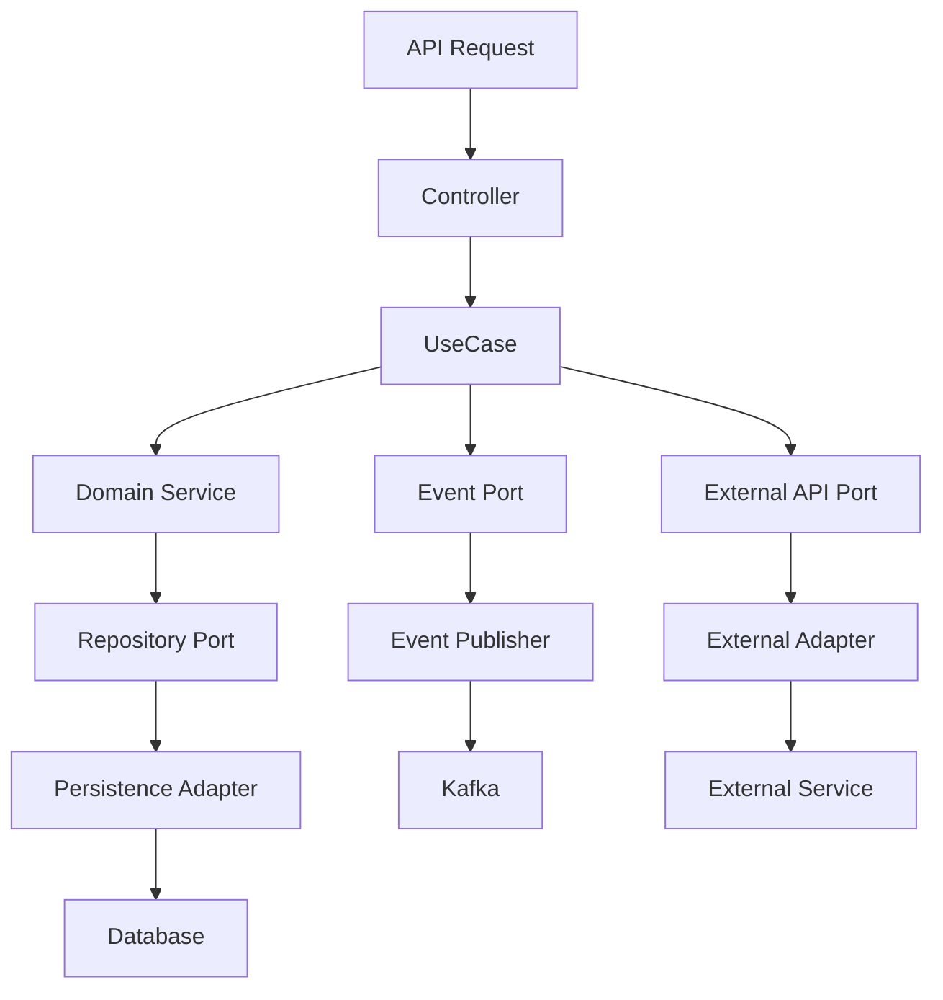
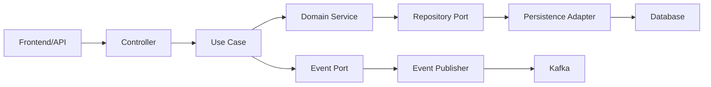
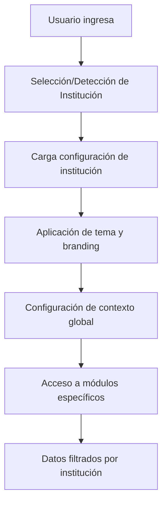

# 🚀 DOCUMENTACIÓN OFICIAL - STACK TECNOLÓGICO PRS1

## 💻 PARTE 4: ARQUITECTURA FRONTEND Y BACKEND

### **🎯 STACK TECNOLÓGICO SELECCIONADO**

---

## 🌐 **FRONTEND STACK**

### **⚛️ React 18+ con Vite**

- **Framework**: React 18 con Hooks y Context API
- **Build Tool**: Vite (desarrollo rápido y HMR)
- **Package Manager**: npm/yarn

### **🎨 Tailwind CSS 4**

- **CSS Framework**: Tailwind CSS v4 (utility-first)
- **Icons**: Heroicons + Lucide React
- **Components**: Headless UI + Radix UI

### **🔧 Librerías Adicionales Frontend**

```json
{
  "react": "^18.2.0",
  "react-dom": "^18.2.0",
  "react-router-dom": "^6.15.0",
  "tailwindcss": "^4.0.0",
  "vite": "^4.4.0",
  "@headlessui/react": "^1.7.0",
  "@heroicons/react": "^2.0.0",
  "react-hook-form": "^7.45.0",
  "react-query": "^5.0.0",
  "zustand": "^4.4.0",
  "axios": "^1.5.0",
  "react-hot-toast": "^2.4.0",
  "framer-motion": "^10.16.0"
}
```

---

## 🏗️ **BACKEND STACK**

### **☕ Spring Boot 3.1+ Reactive**

- **Framework**: Spring Boot 3.1+ con WebFlux
- **Programming Language**: Java 17+
- **Reactive**: Spring WebFlux + Project Reactor

### **🗄️ Bases de Datos**

- **PostgreSQL 15+**: Para servicios transaccionales
- **MongoDB 7+**: Para servicios con datos flexibles
- **Redis 7+**: Para caché distribuido

### **📦 Librerías Backend (por microservicio)**

```xml
<dependencies>
    <!-- Spring Boot Reactive -->
    <dependency>
        <groupId>org.springframework.boot</groupId>
        <artifactId>spring-boot-starter-webflux</artifactId>
    </dependency>

    <!-- Database Reactive -->
    <dependency>
        <groupId>org.springframework.boot</groupId>
        <artifactId>spring-boot-starter-data-r2dbc</artifactId>
    </dependency>
    <dependency>
        <groupId>org.springframework.boot</groupId>
        <artifactId>spring-boot-starter-data-mongodb-reactive</artifactId>
    </dependency>

    <!-- Security -->
    <dependency>
        <groupId>org.springframework.boot</groupId>
        <artifactId>spring-boot-starter-security</artifactId>
    </dependency>
    <dependency>
        <groupId>io.jsonwebtoken</groupId>
        <artifactId>jjwt-api</artifactId>
    </dependency>

    <!-- Kafka Reactive -->
    <dependency>
        <groupId>io.projectreactor.kafka</groupId>
        <artifactId>reactor-kafka</artifactId>
    </dependency>

    <!-- Validation -->
    <dependency>
        <groupId>org.springframework.boot</groupId>
        <artifactId>spring-boot-starter-validation</artifactId>
    </dependency>

    <!-- Monitoring -->
    <dependency>
        <groupId>org.springframework.boot</groupId>
        <artifactId>spring-boot-starter-actuator</artifactId>
    </dependency>
    <dependency>
        <groupId>io.micrometer</groupId>
        <artifactId>micrometer-registry-prometheus</artifactId>
    </dependency>
</dependencies>
```

---

## 🏛️ **ARQUITECTURA HEXAGONAL - BACKEND UNIFICADA**

### **🎯 ARQUITECTURA ESTÁNDAR PARA TODOS LOS MICROSERVICIOS**

> **IMPORTANTE**: Todos los 11 microservicios (MS-VG-0001 a MS-VG-0011) deben seguir EXACTAMENTE la misma estructura de arquitectura hexagonal para garantizar consistencia, mantenibilidad y facilidad de desarrollo por el equipo de 10 desarrolladores.

### **¿Por qué Arquitectura Hexagonal Unificada?**

✅ **Consistencia absoluta**: Misma estructura en todos los microservicios
✅ **Facilidad de mantenimiento**: Un desarrollador puede trabajar en cualquier microservicio
✅ **Testabilidad**: Mismos patrones de testing en todos los servicios
✅ **Flexibilidad**: Cambiar implementaciones sin afectar la lógica de negocio
✅ **Escalabilidad**: Cada puerto puede escalar independientemente
✅ **Onboarding rápido**: Nuevos desarrolladores entienden rápidamente la estructura
✅ **Code review eficiente**: Mismos estándares y patrones en todo el proyecto

### **📂 Estructura de Carpetas Backend ESTÁNDAR (TODOS los microservicios)**

> **📋 TEMPLATE OBLIGATORIO**: Esta estructura debe replicarse EXACTAMENTE en cada uno de los 11 microservicios, cambiando únicamente el nombre del dominio específico (User, Institution, Grade, etc.).

```bash
ms-vg-000X-service/                       # 🏷️ RAÍZ DEL MICROSERVICIO
├── src/main/java/com/prs1/msservice/
│   ├── domain/                           # 🏛️ DOMINIO (Hexágono Interior) - MISMA ESTRUCTURA TODOS
│   │   ├── model/                        # Entidades del dominio específico
│   │   │   ├── [DomainEntity].java       # Ej: User.java, Institution.java, Grade.java
│   │   │   ├── [RelatedEntity].java      # Entidades relacionadas del dominio
│   │   │   └── valueobjects/             # Value Objects del dominio
│   │   │       ├── [DomainId].java       # Ej: UserId.java, InstitutionId.java
│   │   │       ├── Email.java            # VOs compartidos cuando aplique
│   │   │       └── [SpecificVO].java     # VOs específicos del dominio
│   │   ├── repository/                   # 🔌 PUERTOS DE SALIDA (Interfaces) - ESTÁNDAR
│   │   │   ├── [Domain]Repository.java   # Ej: UserRepository.java, InstitutionRepository.java
│   │   │   └── [Related]Repository.java  # Repositorios relacionados
│   │   ├── service/                      # 🎯 SERVICIOS DEL DOMINIO - MISMA ESTRUCTURA
│   │   │   ├── [Domain]DomainService.java    # Lógica de negocio pura
│   │   │   └── [Domain]ValidationService.java # Validaciones de dominio
│   │   └── exception/                    # ⚠️ EXCEPCIONES DEL DOMINIO - ESTÁNDAR
│   │       ├── [Domain]NotFoundException.java
│   │       ├── [Domain]ValidationException.java
│   │       └── DomainException.java      # Excepción base
│   │
│   ├── application/                      # 🎯 APLICACIÓN (Casos de Uso) - ESTRUCTURA IDÉNTICA
│   │   ├── port/                         # 🔌 PUERTOS (MISMA ORGANIZACIÓN TODOS)
│   │   │   ├── in/                       # ⬇️ PUERTOS DE ENTRADA - ESTÁNDAR
│   │   │   │   ├── Create[Domain]UseCase.java    # Ej: CreateUserUseCase.java
│   │   │   │   ├── Find[Domain]UseCase.java      # Ej: FindUserUseCase.java
│   │   │   │   ├── Update[Domain]UseCase.java    # Ej: UpdateUserUseCase.java
│   │   │   │   ├── Delete[Domain]UseCase.java    # Ej: DeleteUserUseCase.java
│   │   │   │   └── List[Domain]UseCase.java      # Ej: ListUserUseCase.java
│   │   │   └── out/                      # ⬆️ PUERTOS DE SALIDA - ESTÁNDAR
│   │   │       ├── [Domain]PersistencePort.java # Persistencia
│   │   │       ├── [Domain]EventPublisherPort.java # Eventos
│   │   │       ├── [Domain]NotificationPort.java   # Notificaciones
│   │   │       └── [Domain]ExternalApiPort.java    # APIs externas
│   │   ├── usecase/                      # 📋 IMPLEMENTACIÓN CASOS DE USO - MISMA ESTRUCTURA
│   │   │   ├── Create[Domain]UseCaseImpl.java    # Implementaciones estándar
│   │   │   ├── Find[Domain]UseCaseImpl.java
│   │   │   ├── Update[Domain]UseCaseImpl.java
│   │   │   ├── Delete[Domain]UseCaseImpl.java
│   │   │   └── List[Domain]UseCaseImpl.java
│   │   └── dto/                          # 📦 DTOs DE APLICACIÓN - ESTRUCTURA IDÉNTICA
│   │       ├── command/                  # Comandos (entrada)
│   │       │   ├── Create[Domain]Command.java
│   │       │   ├── Update[Domain]Command.java
│   │       │   └── Delete[Domain]Command.java
│   │       ├── query/                    # Queries (consultas)
│   │       │   ├── [Domain]Query.java
│   │       │   └── [Domain]FilterQuery.java
│   │       └── response/                 # Respuestas
│   │           ├── [Domain]Response.java
│   │           └── [Domain]ListResponse.java
│   │
│   ├── infrastructure/                   # 🔌 INFRAESTRUCTURA (Adaptadores) - ESTÁNDAR TODOS
│   │   ├── adapter/
│   │   │   ├── in/                       # ⬇️ ADAPTADORES DE ENTRADA - MISMA ESTRUCTURA
│   │   │   │   ├── web/                  # 🌐 REST Controllers - ESTÁNDAR
│   │   │   │   │   ├── [Domain]Controller.java   # Ej: UserController.java
│   │   │   │   │   ├── dto/              # DTOs web específicos
│   │   │   │   │   │   ├── Create[Domain]Request.java
│   │   │   │   │   │   ├── Update[Domain]Request.java
│   │   │   │   │   │   └── [Domain]ResponseDto.java
│   │   │   │   │   └── mapper/           # Mappers web
│   │   │   │   │       └── [Domain]WebMapper.java
│   │   │   │   ├── messaging/            # 📨 Event Listeners - ESTÁNDAR
│   │   │   │   │   ├── [Domain]EventListener.java
│   │   │   │   │   ├── dto/
│   │   │   │   │   │   └── [Domain]EventDto.java
│   │   │   │   │   └── mapper/
│   │   │   │   │       └── [Domain]EventMapper.java
│   │   │   │   └── scheduler/            # ⏰ Scheduled Tasks - ESTÁNDAR
│   │   │   │       └── [Domain]CleanupScheduler.java
│   │   │   └── out/                      # ⬆️ ADAPTADORES DE SALIDA - ESTRUCTURA IDÉNTICA
│   │   │       ├── persistence/          # 💾 Database Adapters - ESTÁNDAR
│   │   │       │   ├── [Domain]PersistenceAdapter.java
│   │   │       │   ├── entity/           # Entidades JPA/MongoDB
│   │   │       │   │   ├── [Domain]Entity.java
│   │   │       │   │   ├── [Related]Entity.java
│   │   │       │   │   └── BaseEntity.java    # Entidad base común
│   │   │       │   ├── repository/       # Repositorios Spring Data
│   │   │       │   │   ├── [Domain]JpaRepository.java     # Para PostgreSQL
│   │   │       │   │   └── [Domain]MongoRepository.java   # Para MongoDB
│   │   │       │   └── mapper/           # Mappers persistencia
│   │   │       │       └── [Domain]PersistenceMapper.java
│   │   │       ├── messaging/            # 📡 Event Publishers - ESTÁNDAR
│   │   │       │   ├── [Domain]EventPublisher.java
│   │   │       │   ├── KafkaEventPublisher.java   # Común a todos
│   │   │       │   └── mapper/
│   │   │       │       └── [Domain]EventPublishMapper.java
│   │   │       ├── external/             # 🌐 External APIs - ESTÁNDAR
│   │   │       │   ├── [Domain]ExternalApiAdapter.java
│   │   │       │   ├── NotificationApiAdapter.java    # Común cuando aplique
│   │   │       │   └── AuthApiAdapter.java           # Común cuando aplique
│   │   │       └── cache/                # 🚀 Cache Adapters - ESTÁNDAR
│   │   │           ├── [Domain]CacheAdapter.java
│   │   │           └── RedisCacheAdapter.java        # Común a todos
│   │   └── config/                       # ⚙️ CONFIGURACIONES - IDÉNTICAS TODOS
│   │       ├── DatabaseConfig.java       # Configuración BD específica
│   │       ├── KafkaConfig.java         # Configuración Kafka (común)
│   │       ├── SecurityConfig.java      # Configuración seguridad
│   │       ├── CacheConfig.java         # Configuración Redis
│   │       └── BeanConfig.java          # Beans de aplicación
│   │
│   └── shared/                           # 🔧 COMPARTIDO - EXACTAMENTE IGUAL TODOS
│       ├── exception/                    # 🚨 Manejo global excepciones
│       │   ├── GlobalExceptionHandler.java    # IDÉNTICO en todos
│       │   ├── ErrorResponse.java             # IDÉNTICO en todos
│       │   └── BusinessException.java         # IDÉNTICO en todos
│       ├── validation/                   # ✅ Validaciones custom
│       │   ├── DocumentNumberValidator.java   # Común cuando aplique
│       │   ├── EmailValidator.java            # Común cuando aplique
│       │   └── [Domain]Validator.java         # Específicos del dominio
│       ├── util/                         # 🛠️ Utilidades
│       │   ├── DateUtils.java                 # IDÉNTICO en todos
│       │   ├── StringUtils.java               # IDÉNTICO en todos
│       │   └── [Domain]Utils.java             # Específicos del dominio
│       └── constant/                     # 📋 Constantes
│           ├── CommonConstants.java           # IDÉNTICO en todos
│           └── [Domain]Constants.java         # Específicos del dominio
```

### **🔄 PATRÓN DE FLUJO ESTÁNDAR (IGUAL EN TODOS LOS MICROSERVICIOS)**



### **📝 CONVENCIONES DE NAMING ESTÁNDAR (TODOS LOS MICROSERVICIOS)**

| Componente | Patrón | Ejemplo MS-VG-0002 (Users) | Ejemplo MS-VG-0006 (Grades) |
|------------|--------|---------------------------|------------------------------|
| **Domain Entity** | `[Domain].java` | `User.java` | `Grade.java` |
| **Value Object** | `[Domain]Id.java` | `UserId.java` | `GradeId.java` |
| **Repository Port** | `[Domain]Repository.java` | `UserRepository.java` | `GradeRepository.java` |
| **Use Case Interface** | `[Action][Domain]UseCase.java` | `CreateUserUseCase.java` | `CreateGradeUseCase.java` |
| **Use Case Impl** | `[Action][Domain]UseCaseImpl.java` | `CreateUserUseCaseImpl.java` | `CreateGradeUseCaseImpl.java` |
| **Controller** | `[Domain]Controller.java` | `UserController.java` | `GradeController.java` |
| **Persistence Adapter** | `[Domain]PersistenceAdapter.java` | `UserPersistenceAdapter.java` | `GradePersistenceAdapter.java` |
| **JPA Entity** | `[Domain]Entity.java` | `UserEntity.java` | `GradeEntity.java` |

### **🎯 BENEFICIOS DE LA ARQUITECTURA HEXAGONAL UNIFICADA**

#### **✅ Para el Equipo de Desarrollo (10 desarrolladores):**

- **Consistency**: Misma estructura en todos los microservicios
- **Productivity**: Desarrollo más rápido por familiaridad
- **Collaboration**: Fácil trabajo entre diferentes microservicios
- **Code Review**: Mismos patrones y estándares
- **Debugging**: Misma lógica de depuración en todos los servicios

#### **✅ Para Mantenimiento:**

- **Predictability**: Saber exactamente dónde está cada componente
- **Refactoring**: Cambios estructurales aplicables a todos los servicios
- **Testing**: Mismas estrategias de testing en todos los microservicios
- **Documentation**: Una sola documentación de arquitectura para todos

#### **✅ Para Escalabilidad:**

- **Horizontal Scaling**: Mismos patrones de escalado
- **Performance**: Optimizaciones aplicables a todos los servicios
- **Monitoring**: Métricas consistentes entre microservicios
- **Deployment**: Mismas estrategias de despliegue

### **🔄 Flujo de Datos en Arquitectura Hexagonal**



---

## 🌐 **ARQUITECTURA FRONTEND MODULAR MULTIORGANIZACIÓN**

### **🏢 DISEÑO MULTIORGANIZACIÓN (MULTITENANT)**

> **🎯 OBJETIVO PRINCIPAL**: El frontend debe soportar múltiples instituciones educativas desde una sola aplicación, permitiendo que diferentes organizaciones accedan a sus datos específicos de forma aislada y segura.

### **¿Por qué Arquitectura Modular Multiorganización?**

✅ **Escalabilidad**: Una sola aplicación para múltiples instituciones educativas
✅ **Aislamiento de datos**: Cada institución ve solo sus datos
✅ **Configurabilidad**: Cada organización puede tener configuraciones específicas
✅ **Eficiencia**: Un solo despliegue para múltiples clientes
✅ **Mantenibilidad**: Actualizaciones centralizadas para todas las organizaciones
✅ **Personalización**: Temas y configuraciones por institución
✅ **Desarrollo en equipo**: Módulos independientes por funcionalidad

### **🏗️ ESTRATEGIA MULTIORGANIZACIÓN**

#### **📋 Niveles de Aislamiento:**

1. **🏛️ Nivel de Datos**: Cada institución accede solo a sus datos
2. **🎨 Nivel de UI**: Temas y branding por institución
3. **⚙️ Nivel de Configuración**: Reglas de negocio específicas por institución
4. **👥 Nivel de Usuarios**: Usuarios pertenecen a una institución específica
5. **🔐 Nivel de Seguridad**: Permisos y roles por institución

#### **🔄 Flujo Multiorganización:**



### **📂 Estructura de Carpetas Frontend MULTIORGANIZACIÓN**

```bash
frontend-sistema-educativo-multiorg/
├── public/
│   ├── favicon.ico
│   ├── themes/                           # 🎨 TEMAS POR INSTITUCIÓN
│   │   ├── default/
│   │   │   ├── logo.png
│   │   │   ├── favicon.ico
│   │   │   └── assets/
│   │   ├── institution-001/              # Tema específico institución 1
│   │   │   ├── logo.png
│   │   │   ├── favicon.ico
│   │   │   └── assets/
│   │   └── institution-002/              # Tema específico institución 2
│   │       ├── logo.png
│   │       ├── favicon.ico
│   │       └── assets/
│   └── configs/                          # ⚙️ CONFIGURACIONES POR INSTITUCIÓN
│       ├── default.json
│       ├── institution-001.json
│       └── institution-002.json
├── src/
│   ├── app/                              # 🚀 CONFIGURACIÓN GLOBAL MULTIORG
│   │   ├── App.tsx                       # App principal con context multiorg
│   │   ├── main.tsx
│   │   ├── router/
│   │   │   ├── AppRouter.tsx             # Router con lógica multiorg
│   │   │   ├── ProtectedRoute.tsx        # Rutas protegidas + institución
│   │   │   ├── InstitutionRoute.tsx      # Rutas específicas por institución
│   │   │   └── routes.ts                 # Definición de rutas
│   │   ├── providers/
│   │   │   ├── AuthProvider.tsx          # Auth con contexto de institución
│   │   │   ├── InstitutionProvider.tsx   # 🏛️ PROVIDER MULTIORGANIZACIÓN
│   │   │   ├── ThemeProvider.tsx         # Temas dinámicos por institución
│   │   │   ├── ConfigProvider.tsx        # Configuraciones por institución
│   │   │   └── QueryProvider.tsx         # React Query con contexto
│   │   ├── store/                        # 📦 ESTADO GLOBAL MULTIORG
│   │   │   ├── authStore.ts              # Auth + institución activa
│   │   │   ├── institutionStore.ts       # 🏛️ STORE INSTITUCIÓN PRINCIPAL
│   │   │   ├── configStore.ts            # Configuraciones dinámicas
│   │   │   ├── themeStore.ts             # Temas por institución
│   │   │   └── index.ts
│   │   └── contexts/                     # 🌐 CONTEXTOS MULTIORG
│   │       ├── InstitutionContext.tsx    # Contexto de institución activa
│   │       ├── MultiTenantContext.tsx    # Contexto multitenant
│   │       └── ConfigContext.tsx         # Configuración dinámica
│   │
│   ├── shared/                           # 🔧 COMPARTIDO MULTIORGANIZACIÓN
│   │   ├── components/                   # Componentes multitenant
│   │   │   ├── ui/                       # 🎨 COMPONENTES UI ADAPTABLES
│   │   │   │   ├── Button/
│   │   │   │   │   ├── Button.tsx        # Soporta temas dinámicos
│   │   │   │   │   ├── Button.themes.ts  # Configuración de temas
│   │   │   │   │   ├── Button.test.tsx
│   │   │   │   │   └── index.ts
│   │   │   │   ├── Input/                # Input con validaciones por institución
│   │   │   │   ├── Modal/                # Modal con branding dinámico
│   │   │   │   ├── Table/                # Tablas con configuraciones
│   │   │   │   ├── LoadingSpinner/       # Spinner con tema dinámico
│   │   │   │   └── InstitutionLogo/      # 🏛️ LOGO DINÁMICO POR INSTITUCIÓN
│   │   │   ├── layout/                   # 🏗️ LAYOUTS MULTIORG
│   │   │   │   ├── MainLayout/
│   │   │   │   │   ├── MainLayout.tsx    # Layout con header dinámico
│   │   │   │   │   ├── Header.tsx        # Header con branding institución
│   │   │   │   │   ├── Sidebar.tsx       # Sidebar con módulos configurables
│   │   │   │   │   └── Footer.tsx        # Footer personalizable
│   │   │   │   ├── AuthLayout/           # Layout para autenticación
│   │   │   │   │   ├── AuthLayout.tsx    # Layout con selector institución
│   │   │   │   │   └── InstitutionSelector.tsx # 🏛️ SELECTOR INSTITUCIÓN
│   │   │   │   └── DashboardLayout/      # Dashboard personalizable
│   │   │   │       ├── DashboardLayout.tsx
│   │   │   │       └── DashboardConfig.tsx # Configuración dashboard
│   │   │   ├── forms/                    # 📝 FORMULARIOS MULTIORG
│   │   │   │   ├── FormField/            # Campos con validaciones dinámicas
│   │   │   │   ├── FormSelect/           # Select con opciones por institución
│   │   │   │   └── FormDatePicker/       # Date picker con calendario académico
│   │   │   └── multiorg/                 # 🏢 COMPONENTES ESPECÍFICOS MULTIORG
│   │   │       ├── InstitutionSwitcher/  # Cambio entre instituciones
│   │   │       ├── BrandingManager/      # Gestión de branding
│   │   │       ├── ConfigurationPanel/  # Panel de configuración
│   │   │       └── TenantGuard/          # Guard para validar institución
│   │   ├── hooks/                        # 🪝 HOOKS MULTIORGANIZACIÓN
│   │   │   ├── useInstitution.ts         # 🏛️ HOOK INSTITUCIÓN PRINCIPAL
│   │   │   ├── useMultiTenant.ts         # Hook para lógica multitenant
│   │   │   ├── useTheme.ts               # Hook para temas dinámicos
│   │   │   ├── useConfig.ts              # Hook para configuraciones
│   │   │   ├── useApi.ts                 # API con contexto institución
│   │   │   ├── useAuth.ts                # Auth con institución
│   │   │   ├── useLocalStorage.ts        # Storage con prefijo institución
│   │   │   └── useDebounce.ts            # Hook compartido
│   │   ├── services/                     # 🔗 SERVICIOS MULTIORG
│   │   │   ├── api/
│   │   │   │   ├── apiClient.ts          # Cliente con headers institución
│   │   │   │   ├── endpoints.ts          # Endpoints con contexto
│   │   │   │   ├── interceptors.ts       # Interceptors multiorg
│   │   │   │   └── tenantConfig.ts       # 🏛️ CONFIGURACIÓN TENANT
│   │   │   ├── auth/
│   │   │   │   ├── authService.ts        # Auth con institución
│   │   │   │   ├── tokenService.ts       # Tokens con contexto
│   │   │   │   └── institutionAuth.ts    # 🏛️ AUTENTICACIÓN POR INSTITUCIÓN
│   │   │   ├── institution/              # 🏛️ SERVICIOS INSTITUCIÓN
│   │   │   │   ├── institutionService.ts # Gestión de instituciones
│   │   │   │   ├── configService.ts      # Configuraciones dinámicas
│   │   │   │   └── themeService.ts       # Gestión de temas
│   │   │   └── notifications/
│   │   │       ├── notificationService.ts # Notificaciones por institución
│   │   │       └── multiorgNotifications.ts # 🏢 NOTIFICACIONES MULTIORG
│   │   ├── utils/                        # 🛠️ UTILIDADES MULTIORG
│   │   │   ├── formatters.ts             # Formateo con configuración
│   │   │   ├── validators.ts             # Validaciones por institución
│   │   │   ├── constants.ts              # Constantes compartidas
│   │   │   ├── helpers.ts                # Helpers generales
│   │   │   ├── tenantUtils.ts            # 🏛️ UTILIDADES TENANT
│   │   │   ├── configUtils.ts            # Utilidades configuración
│   │   │   └── themeUtils.ts             # Utilidades de tema
│   │   └── types/                        # 📝 TYPES MULTIORG
│   │       ├── api.types.ts              # Types API con contexto
│   │       ├── auth.types.ts             # Types auth + institución
│   │       ├── institution.types.ts      # 🏛️ TYPES INSTITUCIÓN PRINCIPAL
│   │       ├── tenant.types.ts           # Types multitenant
│   │       ├── config.types.ts           # Types configuración
│   │       ├── theme.types.ts            # Types tema
│   │       └── common.types.ts           # Types comunes
│   │
│   ├── modules/                          # 📦 MÓDULOS MULTIORGANIZACIÓN
│   │   ├── institution/                  # 🏛️ MS-VG-0001: Institution Management
│   │   │   ├── components/
│   │   │   │   ├── InstitutionForm/      # Formulario con validaciones específicas
│   │   │   │   ├── CampusList/           # Lista filtrada por institución
│   │   │   │   ├── CalendarConfig/       # Configuración calendario específico
│   │   │   │   ├── CivicDatesManager/    # 🇵🇪 GESTOR FECHAS CÍVICAS
│   │   │   │   ├── CivicDateForm/        # 🇵🇪 FORMULARIO FECHAS CÍVICAS
│   │   │   │   ├── CivicDatesCalendar/   # 🇵🇪 CALENDARIO FECHAS CÍVICAS
│   │   │   │   ├── CivicDateCard/        # 🇵🇪 TARJETA FECHA CÍVICA
│   │   │   │   └── MultiorgSettings/     # 🏢 CONFIGURACIONES MULTIORG
│   │   │   ├── pages/
│   │   │   │   ├── InstitutionDashboard.tsx # Dashboard específico institución
│   │   │   │   ├── InstitutionSettings.tsx  # Configuraciones institución
│   │   │   │   ├── CampusManagement.tsx     # Gestión sedes
│   │   │   │   ├── AcademicCalendar.tsx     # Calendario académico
│   │   │   │   ├── CivicDatesManagement.tsx # 🇵🇪 GESTIÓN FECHAS CÍVICAS
│   │   │   │   ├── CivicDatesWebDisplay.tsx # 🇵🇪 VISTA WEB FECHAS CÍVICAS
│   │   │   │   └── InstitutionSwitcher.tsx  # 🏢 CAMBIO ENTRE INSTITUCIONES
│   │   │   ├── hooks/
│   │   │   │   ├── useInstitution.ts        # Hook institución específica
│   │   │   │   ├── useCampuses.ts           # Hook sedes filtradas
│   │   │   │   ├── useCivicDates.ts         # 🇵🇪 HOOK FECHAS CÍVICAS
│   │   │   │   ├── useCivicDatesCalendar.ts # 🇵🇪 HOOK CALENDARIO CÍVICO
│   │   │   │   └── useInstitutionConfig.ts  # 🏛️ HOOK CONFIGURACIÓN ESPECÍFICA
│   │   │   ├── services/
│   │   │   │   ├── institutionService.ts    # Servicio con filtro institución
│   │   │   │   ├── civicDatesService.ts     # 🇵🇪 SERVICIO FECHAS CÍVICAS
│   │   │   │   └── multiorgService.ts       # 🏢 SERVICIO MULTIORGANIZACIÓN
│   │   │   ├── types/
│   │   │   │   ├── institution.types.ts     # Types específicos
│   │   │   │   ├── civicDates.types.ts      # 🇵🇪 TYPES FECHAS CÍVICAS
│   │   │   │   └── multiorg.types.ts        # 🏢 TYPES MULTIORG
│   │   │   └── store/
│   │   │       ├── institutionStore.ts      # Store específico
│   │   │       ├── civicDatesStore.ts       # 🇵🇪 STORE FECHAS CÍVICAS
│   │   │       └── multiorgStore.ts         # 🏢 STORE MULTIORGANIZACIÓN
│   │   │
│   │   ├── users/                        # 👥 MS-VG-0002: User Management MULTIORG
│   │   │   ├── components/
│   │   │   │   ├── UserForm/              # Formulario con validaciones por institución
│   │   │   │   ├── UserList/              # Lista filtrada por institución
│   │   │   │   ├── StudentProfile/        # Perfil estudiantil específico
│   │   │   │   ├── TeacherProfile/        # Perfil docente específico
│   │   │   │   ├── ParentProfile/         # Perfil padre de familia
│   │   │   │   └── InstitutionUserManager/ # 🏛️ GESTOR USUARIOS POR INSTITUCIÓN
│   │   │   ├── pages/
│   │   │   │   ├── UsersManagement.tsx    # Gestión usuarios filtrada
│   │   │   │   ├── StudentDetails.tsx     # Detalles estudiante
│   │   │   │   ├── TeacherDetails.tsx     # Detalles profesor
│   │   │   │   ├── UserProfile.tsx        # Perfil usuario
│   │   │   │   └── CrossInstitutionUsers.tsx # 🏢 USUARIOS MULTI-INSTITUCIÓN
│   │   │   ├── hooks/
│   │   │   │   ├── useUsers.ts            # Hook usuarios filtrados
│   │   │   │   ├── useStudents.ts         # Hook estudiantes específicos
│   │   │   │   ├── useTeachers.ts         # Hook profesores específicos
│   │   │   │   └── useInstitutionUsers.ts # 🏛️ HOOK USUARIOS POR INSTITUCIÓN
│   │   │   ├── services/
│   │   │   │   ├── userService.ts         # Servicio con contexto institución
│   │   │   │   └── multiorgUserService.ts # 🏢 SERVICIO USUARIOS MULTIORG
│   │   │   └── types/
│   │   │       ├── user.types.ts          # Types usuarios
│   │   │       └── institutionUser.types.ts # 🏛️ TYPES USUARIOS INSTITUCIÓN
│   │   │
│   │   ├── auth/                         # 🔐 MS-VG-0003: Authentication MULTIORG
│   │   │   ├── components/
│   │   │   │   ├── LoginForm/             # Login con selector institución
│   │   │   │   ├── InstitutionSelector/   # 🏛️ SELECTOR INSTITUCIÓN EN LOGIN
│   │   │   │   ├── ForgotPasswordForm/    # Recuperación con contexto
│   │   │   │   └── ChangePasswordForm/    # Cambio contraseña
│   │   │   ├── pages/
│   │   │   │   ├── Login.tsx              # Login multiorganización
│   │   │   │   ├── InstitutionLogin.tsx   # 🏛️ LOGIN ESPECÍFICO INSTITUCIÓN
│   │   │   │   ├── ForgotPassword.tsx     # Recuperación contraseña
│   │   │   │   └── ResetPassword.tsx      # Reset contraseña
│   │   │   ├── hooks/
│   │   │   │   ├── useAuth.ts             # Auth con institución
│   │   │   │   └── useInstitutionAuth.ts  # 🏛️ AUTH ESPECÍFICO INSTITUCIÓN
│   │   │   └── services/
│   │   │       ├── authService.ts         # Auth con contexto multiorg
│   │   │       └── institutionAuthService.ts # 🏛️ AUTH POR INSTITUCIÓN
│   │   │
│   │   ├── academic/                     # 📚 MS-VG-0004: Academic MULTIORG (todos filtrados)
│   │   ├── assignments/                  # 👨‍🏫 MS-VG-0005: Assignments MULTIORG
│   │   ├── grades/                       # 📊 MS-VG-0006: Grades MULTIORG
│   │   ├── attendance/                   # 📅 MS-VG-0007: Attendance MULTIORG
│   │   ├── psychology/                   # 🧠 MS-VG-0008: Psychology MULTIORG
│   │   ├── discipline/                   # ⚖️ MS-VG-0009: Discipline MULTIORG
│   │   ├── inventory/                    # 📦 MS-VG-0010: Inventory MULTIORG
│   │   └── notifications/                # 📱 MS-VG-0011: Notifications MULTIORG
│   │
│   └── assets/                           # 🎨 RECURSOS MULTIORGANIZACIÓN
│       ├── themes/                       # 🎨 TEMAS POR INSTITUCIÓN
│       │   ├── default/
│       │   ├── theme-01/
│       │   └── theme-02/
│       ├── images/
│       │   ├── common/                   # Imágenes comunes
│       │   └── institutions/             # 🏛️ IMÁGENES POR INSTITUCIÓN
│       │       ├── institution-001/
│       │       └── institution-002/
│       ├── icons/
│       └── fonts/
```

### **🏛️ COMPONENTES CLAVE MULTIORGANIZACIÓN**

#### **1. InstitutionProvider.tsx**

```typescript
interface InstitutionContextType {
  currentInstitution: Institution | null;
  institutions: Institution[];
  switchInstitution: (institutionId: string) => void;
  institutionConfig: InstitutionConfig;
  theme: InstitutionTheme;
  isLoading: boolean;
}

export const InstitutionProvider: React.FC<{ children: React.ReactNode }> = ({ children }) => {
  // Lógica para gestionar el contexto de institución actual
  // Cambio entre instituciones
  // Carga de configuraciones específicas
  // Aplicación de temas dinámicos
};
```

#### **2. useInstitution Hook**

```typescript
export const useInstitution = () => {
  const context = useContext(InstitutionContext);

  return {
    currentInstitution: context.currentInstitution,
    switchInstitution: context.switchInstitution,
    config: context.institutionConfig,
    theme: context.theme,
    isValidInstitution: context.currentInstitution !== null,
    institutionId: context.currentInstitution?.id,
    // Métodos específicos para multiorganización
  };
};
```

#### **3. API Client con Contexto de Institución**

```typescript
export const apiClient = axios.create({
  baseURL: process.env.REACT_APP_API_BASE_URL,
});

// Interceptor que añade headers de institución a todas las requests
apiClient.interceptors.request.use((config) => {
  const institutionId = useInstitutionStore.getState().currentInstitution?.id;

  if (institutionId) {
    config.headers['X-Institution-ID'] = institutionId;
    config.headers['X-Tenant-ID'] = institutionId;
  }

  return config;
});
```

### **🔐 SEGURIDAD MULTIORGANIZACIÓN**

#### **Estrategias de Aislamiento:**

1. **Header-based Tenancy**: `X-Institution-ID` en todas las requests
2. **URL-based Tenancy**: Subdominios por institución (opcional)
3. **Token-based Tenancy**: JWT con claims de institución
4. **Database-level Isolation**: Filtros automáticos por institución

#### **Validaciones de Seguridad:**

- ✅ Usuario solo accede a datos de su institución
- ✅ APIs validan pertenencia a institución en cada request
- ✅ Frontend oculta módulos no disponibles por institución
- ✅ Caché separado por institución

### **🎨 TEMAS Y BRANDING DINÁMICO**

#### **Sistema de Temas:**

```typescript
interface InstitutionTheme {
  primary: string;
  secondary: string;
  logo: string;
  favicon: string;
  brandName: string;
  colors: {
    background: string;
    text: string;
    accent: string;
  };
  fonts: {
    heading: string;
    body: string;
  };
}
```

#### **Aplicación Dinámica:**

- 🎨 CSS Variables actualizadas dinámicamente
- 🖼️ Logo e imágenes cargadas por institución
- 🎯 Componentes adaptables a diferentes temas
- 📱 Favicon dinámico por institución

---

## 🛠️ **CONFIGURACIÓN Y HERRAMIENTAS DE DESARROLLO**

### **Backend Configuration**

#### **application.yml (por microservicio)**

```yaml
spring:
  application:
    name: ms-vg-000X-service
  profiles:
    active: ${ENV:dev}

  # WebFlux Configuration
  webflux:
    base-path: /api/v1

  # Database Configuration
  r2dbc:
    url: r2dbc:postgresql://localhost:5432/ms_vg_000X_db
    username: ${DB_USER:postgres}
    password: ${DB_PASSWORD:password}
    pool:
      initial-size: 10
      max-size: 30

  # MongoDB Configuration (for applicable services)
  data:
    mongodb:
      uri: mongodb://localhost:27017/ms_vg_000X_db

  # Kafka Configuration
  kafka:
    bootstrap-servers: localhost:9092
    producer:
      key-serializer: org.apache.kafka.common.serialization.StringSerializer
      value-serializer: org.springframework.kafka.support.serializer.JsonSerializer
    consumer:
      group-id: ms-vg-000X-group
      key-deserializer: org.apache.kafka.common.serialization.StringDeserializer
      value-deserializer: org.springframework.kafka.support.serializer.JsonDeserializer

server:
  port: 800X

# Actuator Configuration
management:
  endpoints:
    web:
      exposure:
        include: health,metrics,prometheus
  endpoint:
    health:
      show-details: always

# Logging Configuration
logging:
  level:
    com.prs1.msservice: DEBUG
    reactor.netty: INFO
  pattern:
    console: "%d{yyyy-MM-dd HH:mm:ss} - %msg%n"
```

### **Frontend Configuration**

#### **vite.config.ts**

```typescript
import { defineConfig } from 'vite'
import react from '@vitejs/plugin-react'
import path from 'path'

export default defineConfig({
  plugins: [react()],
  resolve: {
    alias: {
      '@': path.resolve(__dirname, './src'),
      '@/shared': path.resolve(__dirname, './src/shared'),
      '@/modules': path.resolve(__dirname, './src/modules'),
      '@/app': path.resolve(__dirname, './src/app')
    }
  },
  server: {
    port: 3000,
    proxy: {
      '/api': {
        target: 'http://localhost:8000', // API Gateway
        changeOrigin: true,
        secure: false
      }
    }
  }
})
```

#### **tailwind.config.js**

```javascript
/** @type {import('tailwindcss').Config} */
export default {
  content: ['./src/**/*.{js,ts,jsx,tsx}'],
  theme: {
    extend: {
      colors: {
        primary: {
          50: '#eff6ff',
          500: '#3b82f6',
          600: '#2563eb',
          700: '#1d4ed8',
        },
        secondary: {
          50: '#f8fafc',
          500: '#64748b',
          600: '#475569',
          700: '#334155',
        }
      },
      fontFamily: {
        sans: ['Inter', 'system-ui', 'sans-serif'],
      }
    },
  },
  plugins: [
    require('@tailwindcss/forms'),
    require('@tailwindcss/typography'),
  ],
}
```

---

## 🧪 **ESTRATEGIA DE TESTING**

### **Backend Testing**

```xml
<!-- Testing Dependencies -->
<dependency>
    <groupId>org.springframework.boot</groupId>
    <artifactId>spring-boot-starter-test</artifactId>
    <scope>test</scope>
</dependency>
<dependency>
    <groupId>io.projectreactor</groupId>
    <artifactId>reactor-test</artifactId>
    <scope>test</scope>
</dependency>
<dependency>
    <groupId>org.testcontainers</groupId>
    <artifactId>postgresql</artifactId>
    <scope>test</scope>
</dependency>
```

### **Frontend Testing**

```json
{
  "devDependencies": {
    "@testing-library/react": "^13.4.0",
    "@testing-library/jest-dom": "^5.16.0",
    "@testing-library/user-event": "^14.4.0",
    "vitest": "^0.34.0",
    "jsdom": "^22.1.0",
    "msw": "^1.3.0"
  }
}
```

---

## 📦 **CONTAINERIZACIÓN**

### **Dockerfile Backend**

```dockerfile
FROM openjdk:17-jdk-slim

WORKDIR /app
COPY target/ms-vg-000X-service.jar app.jar

EXPOSE 800X

ENTRYPOINT ["java", "-jar", "app.jar"]
```

### **Dockerfile Frontend**

```dockerfile
FROM node:18-alpine as build

WORKDIR /app
COPY package*.json ./
RUN npm ci

COPY . .
RUN npm run build

FROM nginx:alpine
COPY --from=build /app/dist /usr/share/nginx/html
COPY nginx.conf /etc/nginx/nginx.conf

EXPOSE 80
```

---

## 🎯 **BENEFICIOS DEL STACK UNIFICADO MULTIORGANIZACIÓN**

### **✅ Backend: Arquitectura Hexagonal Consistente (11 Microservicios)**

#### **🏗️ Consistencia Arquitectónica:**

- **Estructura idéntica**: Todos los microservicios siguen exactamente el mismo patrón
- **Onboarding rápido**: Nuevos desarrolladores comprenden rápidamente cualquier microservicio
- **Mantenimiento eficiente**: Cambios arquitectónicos aplicables a todos los servicios
- **Code review estandarizado**: Mismos patrones y convenciones en todo el proyecto

#### **🚀 Escalabilidad y Performance:**

- **Patrones de escalado uniformes**: Mismas estrategias para todos los microservicios
- **Optimizaciones centralizadas**: Mejoras aplicables a todo el sistema
- **Monitoring consistente**: Métricas y observabilidad estándar
- **Deployment automatizado**: Mismos procesos de CI/CD para todos

#### **🧪 Testing y Calidad:**

- **Estrategias de testing unificadas**: Mismos patrones de testing en todos los servicios
- **Herramientas compartidas**: Mismas librerías y frameworks de testing
- **Coverage consistente**: Estándares de cobertura aplicables a todos
- **Debugging predecible**: Misma lógica de depuración en todos los microservicios

### **✅ Frontend: Arquitectura Multiorganización**

#### **🏢 Escalabilidad Multitenant:**

- **Una aplicación, múltiples organizaciones**: Eficiencia en desarrollo y mantenimiento
- **Aislamiento de datos**: Cada institución accede solo a sus datos específicos
- **Personalización dinámica**: Temas, branding y configuraciones por institución
- **Gestión centralizada**: Actualizaciones y mejoras para todas las organizaciones

#### **🎨 Experiencia de Usuario Personalizada:**

- **Branding dinámico**: Logo, colores y temas específicos por institución
- **Configuraciones adaptables**: Reglas de negocio específicas por organización
- **Contexto inteligente**: Datos y opciones filtrados automáticamente
- **Interfaz consistente**: Misma experiencia base, personalización específica

#### **🔐 Seguridad Multiorganización:**

- **Aislamiento por headers**: `X-Institution-ID` en todas las comunicaciones
- **Validación de contexto**: Verificación automática de pertenencia a institución
- **Tokens contextualizados**: JWT con información de institución
- **Caché segregado**: Datos separados por organización

### **✅ Ventajas del Stack Completo Unificado**

#### **👥 Para el Equipo de 10 Desarrolladores:**

```
🎯 PRODUCTIVIDAD MAXIMIZADA:
├── 📋 Estructura predecible en todos los microservicios
├── 🚀 Desarrollo más rápido por familiaridad con patrones
├── 🔄 Fácil rotación entre diferentes microservicios
├── 📚 Una sola documentación arquitectónica para todos
├── 🧪 Mismas herramientas y estrategias de testing
└── 🔍 Debugging y troubleshooting consistente
```

#### **🏗️ Para Mantenimiento y Evolución:**

```
📈 MANTENIBILIDAD SUPERIOR:
├── 🔧 Refactoring aplicable a todos los microservicios
├── ⬆️ Actualizaciones de dependencias centralizadas
├── 📊 Métricas y monitoring estándar
├── 🚀 Optimizaciones de performance replicables
├── 🔒 Parches de seguridad aplicables globalmente
└── 📦 Deployment y CI/CD unificado
```

#### **🌐 Para Escalabilidad Multiorganización:**

```
🏢 ESCALABILIDAD EMPRESARIAL:
├── 🏛️ Soporte para múltiples instituciones educativas
├── 💼 Modelo de negocio SaaS escalable
├── ⚙️ Configuraciones específicas por cliente
├── 🎨 Personalización de marca por institución
├── 📊 Analíticas segregadas por organización
└── 🔐 Seguridad y compliance por institución
```

### **🎯 Resultado Final: Sistema Educativo de Clase Empresarial**

#### **📋 Características Principales:**

- ✅ **11 microservicios** con arquitectura hexagonal idéntica
- ✅ **Frontend multiorganización** con personalización dinámica
- ✅ **Tecnologías modernas**: React 18, Spring Boot 3, Java 17
- ✅ **Bases de datos especializadas**: PostgreSQL y MongoDB según necesidad
- ✅ **Arquitectura reactiva**: Frontend y backend non-blocking
- ✅ **Seguridad robusta**: JWT, RBAC, aislamiento por institución
- ✅ **Monitoring y observabilidad**: Métricas, logs y trazabilidad completa
- ✅ **CI/CD automatizado**: Deployment containerizado con Docker

#### **🚀 Beneficios Estratégicos:**

- **🏗️ Arquitectura de nivel empresarial** preparada para escalar
- **👥 Desarrollo eficiente** para equipo de 10 desarrolladores
- **🏢 Modelo multitenant** para múltiples instituciones educativas
- **🔧 Mantenimiento simplificado** con patrones consistentes
- **📈 Escalabilidad horizontal** en todos los componentes
- **🎯 Time-to-market reducido** por reutilización de patrones

### **📝 Recomendaciones de Implementación**

#### **🔄 Orden de Desarrollo Sugerido:**

1. **📋 Configuración inicial**: Setup de proyectos con estructura estándar
2. **🏛️ MS-VG-0001**: Institution Management (base fundamental)
3. **👥 MS-VG-0002**: User Management (usuarios del sistema)
4. **🔐 MS-VG-0003**: Auth & Security (autenticación y autorización)
5. **📚 MS-VG-0004**: Academic Management (gestión académica)
6. **⚖️ Microservicios restantes**: Siguiendo el mismo patrón arquitectónico

#### **🎯 Puntos Críticos de Éxito:**

- **📋 Documentación arquitectónica** detallada para todos
- **🧪 Setup de testing** estándar desde el inicio
- **🔄 Code review** estricto para mantener consistencia
- **📊 Monitoring** implementado desde el primer microservicio
- **🚀 CI/CD** configurado para todos los servicios
- **🏢 Configuración multitenant** desde el primer día

Este stack tecnológico unificado garantiza un sistema educativo robusto, escalable y mantenible, preparado para crecer con las necesidades de múltiples instituciones educativas. 🎓
